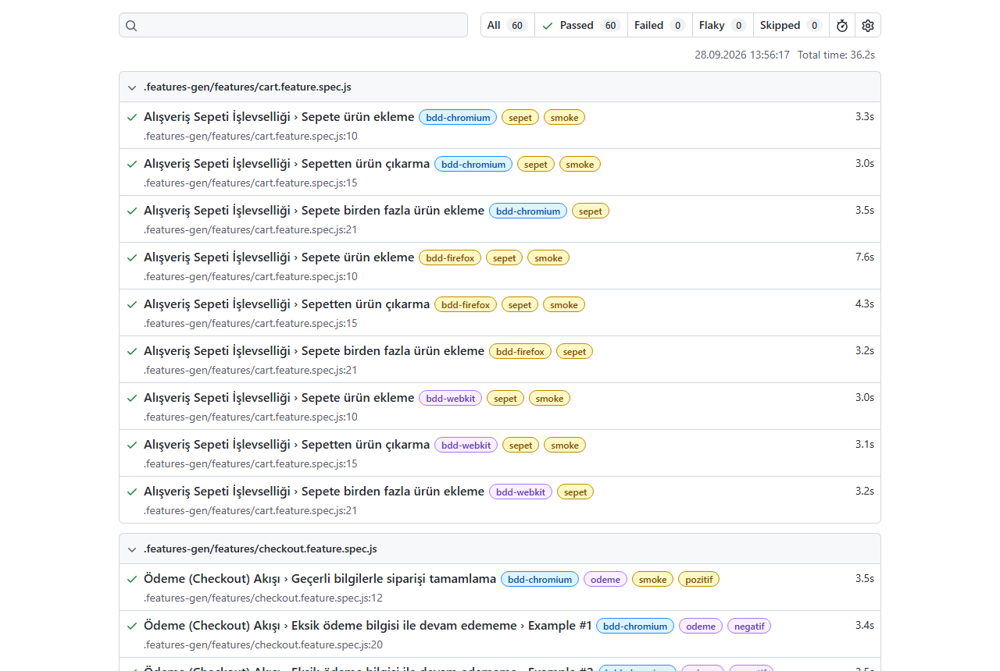

# Playwright BDD E2E Framework

[](https://github.com/db-akyol/playwright-bdd-e2e-framework/actions/workflows/playwright.yml)


End-to-end UI test automation for the [SauceDemo](https://www.saucedemo.com) e-commerce demo site.
Test scenarios are written in **Gherkin (BDD)**, run with **Playwright** on three browsers, and use a **Page Object Model** layer.
Tests run automatically on every push with **GitHub Actions**.



## What is tested

| Feature | Scenarios | Tags |
|---|---|---|
| **Login** (`features/login.feature`) | Valid login, wrong password, locked-out user, data-driven check for 3 user types (Scenario Outline) | `@giris` |
| **Cart** (`features/cart.feature`) | Add one product, remove a product, add multiple products | `@sepet` |
| **Checkout** (`features/checkout.feature`) | Complete an order, required-field validation for first name / last name / postal code (Scenario Outline) | `@odeme` |
| **Classic specs** (`tests/*.spec.ts`) | Login page, product list, sorting by price, cart, full purchase flow | — |

Other tags: `@smoke` (critical path), `@pozitif` (positive), `@negatif` (negative).

The Gherkin steps are written in Turkish, for example:

```gherkin
Scenario: Geçerli bilgilerle siparişi tamamlama          # Complete an order with valid data
  When ödeme bilgilerini "Deniz", "Akyol" ve "21000" olarak giriyorum
  And siparişi onaylıyorum
  Then "Thank you for your order!" onay mesajını görmeliyim
```

## Framework design

- **BDD with playwright-bdd**: `.feature` files are compiled into Playwright tests (`bddgen`), so there is no separate Cucumber runner and all Playwright features (parallel runs, traces, retries) still work.
- **Page Object Model**: all locators live in `pages/`. Step definitions never use a locator directly.
- **Fixtures instead of global state**: every page object is a Playwright fixture (`features/steps/fixtures.ts`). Each scenario gets its own objects, so parallel runs are safe.
- **Cross-browser**: BDD scenarios run on Chromium, Firefox and WebKit.
- **Stable waits**: no `waitForTimeout`. Page objects wait for the right element before they read data.
- **Debug artifacts**: screenshot and video on failure, trace on the first retry.
- **CI**: GitHub Actions runs type checking and all tests, then uploads the HTML report as an artifact.

## Project structure

```
├── features/
│   ├── login.feature          # Login scenarios
│   ├── cart.feature           # Cart scenarios
│   ├── checkout.feature       # Checkout scenarios
│   └── steps/
│       ├── fixtures.ts        # Page objects as Playwright fixtures
│       ├── login.steps.ts
│       ├── cart.steps.ts
│       └── checkout.steps.ts
├── pages/                     # Page Object Model
│   ├── BasePage.ts
│   ├── LoginPage.ts
│   ├── InventoryPage.ts
│   ├── CartPage.ts
│   └── CheckoutPage.ts
├── tests/                     # Classic Playwright specs using the same page objects
├── utils/testData.ts          # Test users, products, error messages
├── playwright.config.ts
└── .github/workflows/playwright.yml
```

## How to run

Requirements: Node.js 18+

```bash
npm install
npx playwright install
npm test
```

| Command | What it does |
|---|---|
| `npm test` | All tests (BDD on 3 browsers + classic specs) |
| `npm run test:bdd` | Only BDD scenarios |
| `npm run test:spec` | Only classic Playwright specs |
| `npm run test:smoke` | Only `@smoke` scenarios |
| `npm run test:login` / `test:cart` / `test:checkout` | One feature |
| `npm run test:headed` | Run with a visible browser |
| `npm run test:ui` | Playwright UI mode |
| `npm run typecheck` | TypeScript check |
| `npm run report` | Open the last HTML report |

## CI

The workflow in `.github/workflows/playwright.yml` runs on push, pull request and manual trigger:

1. Install dependencies with `npm ci`
2. Type check with `tsc`
3. Install browsers
4. Run all tests (2 retries on CI)
5. Upload the HTML report (kept for 30 days)

## License

[MIT](LICENSE)
